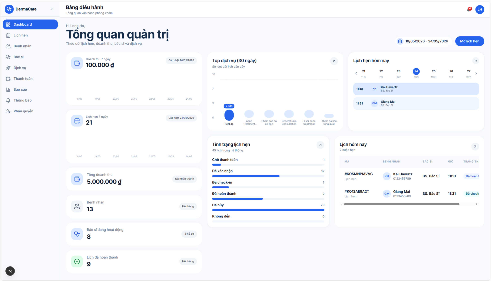

# DermaCare Clinic Platform

DermaCare Clinic Platform là hệ thống vận hành phòng khám da liễu: đặt lịch, thanh toán cọc, check-in, khám bệnh, hồ sơ lâm sàng, theo dõi điều trị, thông báo, báo cáo và AI hỗ trợ tiếp nhận bệnh nhân.

Codebase dùng Next.js App Router, Supabase Auth, PostgreSQL, Prisma, phân quyền theo vai trò, SePay webhook, Groq chatbot, Hugging Face skin analysis và Google Drive cho ảnh lâm sàng.

## Demo



## Sản Phẩm

- Public booking cho khách và bệnh nhân đã đăng nhập.
- Patient portal: lịch hẹn, bác sĩ, hồ sơ sức khỏe, tiến trình điều trị, waitlist, notification, chat.
- Staff workspace: vận hành lịch hẹn, patient lookup, check-in, xác nhận thanh toán, báo cáo.
- Doctor workspace: lịch khám, encounter, medical records, prescriptions, skin images, treatment plans, follow-up.
- Admin console: users, doctors, services, patients, payments, permissions, reports, notifications, dashboard.
- AI workflows: clinic Q&A, recommendation, booking support, skin analysis, patient-safe progress summary.

## Luồng Chính

**Booking/payment:** tạo appointment `PENDING_PAYMENT`, hiển thị SePay QR, nhận `POST /api/webhook`, verify `Authorization: apikey <WEBHOOK_SECRET>`, parse memo `CK {appointment-id-fragment}`, xác nhận payment, chuyển appointment sang `CONFIRMED`, tạo payment record, medical record shell và notification.

**Clinical visit:** staff check-in, doctor ghi nhận encounter, diagnosis, notes, prescriptions, treatments, observations, conditions, follow-up notes, treatment plans và skin images. Patient UI chỉ hiển thị projection an toàn, không lộ raw AI label, confidence score hoặc model output.

## Kiến Trúc

```text
app/                 Routes theo public, auth, patient, staff, doctor, admin, api
lib/actions/         Server actions và business transactions
lib/auth/            Role guards và redirects
lib/chatbot/         Booking intent, RAG, embedding
lib/supabase/        Supabase clients
services/            Domain services
components/          Shared UI và feature components
hooks/               Client workflow hooks
prisma/              Schema, migrations, RLS policies
embedding-service/   Local embedding service cho RAG
tests/               Playwright tests
__tests__/           Vitest tests
scripts/             Setup, seed, validation, workflow helpers
```

Mutation quan trọng nên đi qua server actions/services để giữ role check, transaction và audit-sensitive logic ở server-side.

## Setup Local

Yêu cầu: Node.js 20+, npm, Supabase project có PostgreSQL access.

```bash
cp .env.example .env.local
npm install
npx prisma generate
npx prisma migrate dev
npm run dev
```

App chạy tại:

```text
http://localhost:3000
```

Chạy embedding service khi cần test chatbot RAG:

```bash
cd embedding-service
python -m venv .venv
source .venv/bin/activate
pip install -r requirements.txt
python embedding_service.py
```

## Environment

Bắt buộc:

```env
NEXT_PUBLIC_SUPABASE_URL=
NEXT_PUBLIC_SUPABASE_ANON_KEY=
DATABASE_URL=
DIRECT_URL=
```

Lưu ý: `.env.example` có `NEXT_PUBLIC_SUPABASE_PUBLISHABLE_KEY`, nhưng runtime code hiện đọc `NEXT_PUBLIC_SUPABASE_ANON_KEY`.

Thanh toán:

```env
WEBHOOK_SECRET=
SEPAY_BANK_CODE=
SEPAY_BANK_ID=
SEPAY_BANK_DISPLAY_NAME=
SEPAY_ACCOUNT_NO=
SEPAY_ACCOUNT_NAME=
```

AI và ảnh lâm sàng:

```env
GROQ_API_KEY=
GROQ_MODEL=openai/gpt-oss-120b
EMBEDDING_SERVICE_URL=http://localhost:8001
HF_API_TOKEN=
HF_API_KEY=
AI_CONFIDENCE_THRESHOLD=0.10
GOOGLE_CLIENT_ID=
GOOGLE_CLIENT_SECRET=
GOOGLE_REFRESH_TOKEN=
GOOGLE_DRIVE_PARENT_FOLDER_ID=
```

## Database

Prisma schema bao gồm các domain chính:

- Identity và phân quyền: `Profile`, `DoctorProfile`, `Role`.
- Booking/payment: `Appointment`, `Payment`, schedules, blocked slots, notifications.
- Clinical records: `Encounter`, `MedicalRecord`, prescriptions, treatments, conditions, observations, follow-up notes, treatment plans.
- AI và knowledge: `SkinImage`, `SkinAnalysisResult`, `ClinicFaq`, `KnowledgeBase`, `ChatSession`, `ChatMessage`.
- Governance: `Consent`, `audit_logs`, `WaitlistEntry`.

Prisma client được generate vào `lib/generated/prisma`. Dùng `DATABASE_URL` cho runtime pooler connection và `DIRECT_URL` cho migrations.

## Scripts

```bash
npm run dev                  # Dev server
npm run build                # Production build
npm run start                # Start built app
npm run lint                 # ESLint
npm test                     # Vitest
npm run test:e2e             # Playwright
npm run format:check         # Prettier check
npm run dead-code            # knip
npm run duplication          # jscpd
npm run seed:knowledge-base  # Seed chatbot knowledge base
npm run test:timeline        # Lint, build, timeline checks
```

## Quality Gates

Trước khi merge thay đổi đáng kể:

```bash
npm run lint
npm test
npm run build
```

Với medical records:

```bash
npx prisma validate
npm test -- medical-records.test.ts
npm run test:timeline:static
```

Với browser-critical flows:

```bash
npm run test:e2e
```

## Security Notes

- Không commit credentials thật. Secret phải nằm trong `.env.local` hoặc deployment environment.
- Payment confirmation phải idempotent vì webhook có thể retry.
- Role-specific pages phải enforce authorization server-side.
- Patient UI không được lộ raw AI labels, confidence scores, raw JSON hoặc model reasoning.
- Public chatbot chỉ trả lời trong public clinic context.

## Deployment

1. Provision Supabase và set env cho database/auth.
2. Chạy Prisma migrations trên database đích.
3. Cấu hình Supabase Auth redirect URLs.
4. Cấu hình SePay webhook: `https://<domain>/api/webhook`.
5. Set AI/Google Drive credentials nếu bật các tính năng tương ứng.
6. Chạy `npm run build` trong CI trước khi release.
